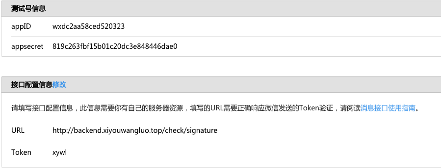
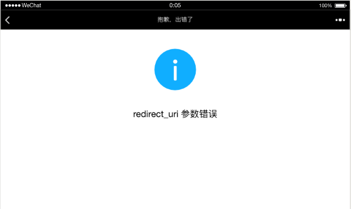
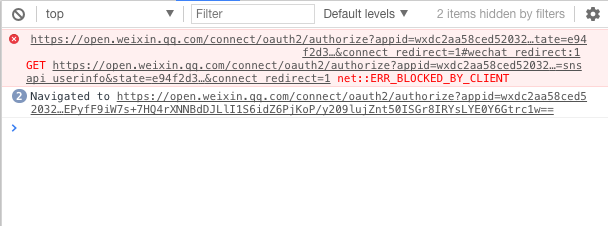
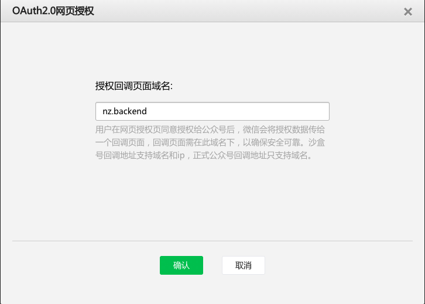
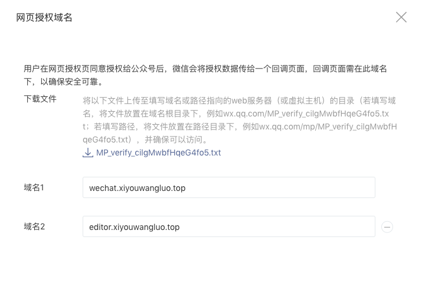

## 参考资料

[开发者文档](https://developers.weixin.qq.com/doc/offiaccount/Getting_Started/Overview.html)

## 第三方验证

1. 通过授权token 检测公众号服务器发来的请求是否生效



2. [官方模板](https://developers.weixin.qq.com/doc/offiaccount/Basic_Information/Access_Overview.html)

3. laravel-wechat方式

+ 配置授权

```env
WECHAT_OFFICIAL_ACCOUNT_APPID=wxdc2aa58ced520323
WECHAT_OFFICIAL_ACCOUNT_SECRET=819c263fbf15b01c20dc3e848446dae0
WECHAT_OFFICIAL_ACCOUNT_TOKEN=xywl
WECHAT_OFFICIAL_ACCOUNT_AES_KEY=
```

+ 配置路由
```php
<?php
Route::any('/check/signature', [Controllers\VerifyController::class, 'verifySign']);
```

+ 微信请求的api
```php
<?php
/**
* WeChat
* 微信请求
*
* @return <+Return+>
*/
public function verifySign() {
    Log::info('request arrived.'); # 注意：Log 为 Laravel 组件，所以它记的日志去 Laravel 日志看，而不是 EasyWeChat 日志

    $app = app('wechat.official_account');
    $app->server->push(function($message){
    return $message;
    });

    return $app->server->serve();
}
```

4. 测试号无法使用scope(snsapi_base/snsapi_userinfo)
+ 可生成默认数据做回调测试
```php
<?php
use Illuminate\Support\Arr;
use Overtrue\Socialite\User as SocialiteUser;

$user = new SocialiteUser([
    'id' => Arr::get($user, 'openid'),
    'name' => Arr::get($user, 'nickname'),
    'nickname' => Arr::get($user, 'nickname'),
    'avatar' => Arr::get($user, 'headimgurl'),
    'email' => null,
    'original' => [],
    'provider' => 'WeChat',
]);
```

5. 测试环境redirect_uri错误原因
+ 错把正式服的oauth地址拿来用





+ 回调域名没有设置





+ console面板错误仍然存在 但跳转可以实现
> TODO: 抛出的重定向错误疑似https造成 <15-11-20, yourname> >


---
## 如何设计

### 定位

1. 如何取名
+ 名字不易过长
+ 突出业务重点
+ 罗列所有相关词汇筛选

2. 分析自己擅长什么
+ 罗列自己的特长
+ 能给用户带来什么


### 功能

1. 自动回复
+ 用作欢迎语展现友好
+ 可以返回链接和图片

2. 素材上传
+ 公众号资源调用的入口

3. 推广文
+ 原文链接可作为自己网站的推广渠道

4. 自定义菜单
+ 服务号才可跳转到网页

5. 编辑模板
+ 可以对文章分类

6. 编辑插件
+ 135编辑器
+ 秀米编辑器
+ 新媒体管家
+ 壹伴

### 图片素材
1. 高清图片免费网站
+ https://www.pexels.com
+ https://unsplash.com
+ http://www.paixin.com
+ http://www.quanjing.com

2. gif免费网站
+ http://www.soogif.com
+ https://giphy.com/

3. 长图
+ 滚动截取工具

4. 智能P图
+ inpaint
+ 泼辣修图

5. 美化二维码
+ https://cli.im

---
## 推广营销

### 用户分析
1. 麦客表单
+ https://cn.mikecrm.com

2. 微小宝
+ http://www.wxb.com

### 短网址
1. 工具网站
+ http://sina.lt
+ http://dwz.cn

### 引流
1. 回答问题引流
+ B站
+ 知乎
+ 微信
+ 今日头条
+ 微博

2. 推广文
3. 构建社区
4. B站视频
